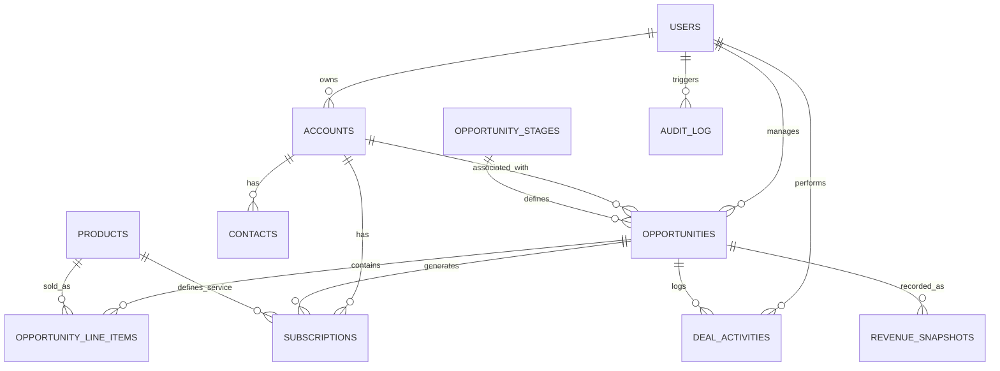

# Entity Relationship Diagram (ERD)

The Revenue Intelligence System is built on a relational PostgreSQL foundation with 11 core entities designed for both operational integrity and analytical depth.

## Data Lineage & Flow
1. **Source Ingestion**: Simulated CRM, Activity, and Usage data is ingested as CSV.
2. **Operational Store**: Data is normalized into the 11 core tables (PostgreSQL).
3. **Analytical Layer**: Complex SQL views and window functions transform operational data into intelligence.
4. **Insights Surface**: Insights are delivered via 12+ analytical views for consumption by TablePlus or external dashboards.
